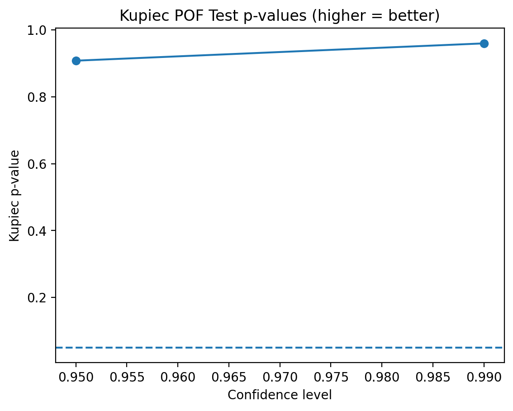

# Portfolio Risk War Room (Python)

A mini risk dashboard for a multi-asset ETF portfolio.  
It ingests historical prices, builds daily returns, computes core risk metrics, estimates VaR/CVaR (Historical + Parametric), and runs simple stress scenarios (“what-if shocks”) to show how tail risk changes under risk-off conditions.

## What this project does (plain language)
- **Turns prices into returns** (daily % changes used for risk)
- **Summarizes risk** (annualized return/volatility, max drawdown, correlations)
- **Measures tail loss** with **VaR / CVaR** at **95% and 99%**
- **Stress tests** the portfolio with realistic “shock” scenarios (equities down, bonds down, gold up)
- Outputs clean **CSVs + figures** you can drop into a report

## VaR Backtest (Kupiec POF)

**What this shows:**
- If the model is calibrated, the actual breach rate should be close to the expected rate (alpha).
- Kupiec p-values > 0.05 generally mean the VaR model passes the POF test.

### Actual vs Expected Breach Rate


### Kupiec POF Test p-values



## Portfolio setup
Example tickers:
- XIU, VFV, XEF, ZAG, GLD, RY

Weights:
- Stored in `data/weights.csv` (must sum to 1.0)

## Project structure
code/
01_download_data*.py
02_make_returns_from_prices.py
03_risk_metrics.py
04_var_cvar.py
05_stress_test.py
data/
weights.csv
returns.csv
portfolio_returns.csv
risk_summary.csv
corr.csv
var_cvar_summary.csv
var_backtest.csv
stress_test_summary.csv
images/
portfolio_nav.png
portfolio_drawdown.png
portfolio_rolling_vol_20d.png
portfolio_returns_hist_var.png
stress_test_hist_compare.png

## How to run
From the project root:

```bash
python code/01_download_data_yahoo_csv.py
python code/02_make_returns_from_prices.py
python code/03_risk_metrics.py
python code/04_var_cvar.py
python code/05_stress_test.py
Outputs (what to look at)
data/risk_summary.csv — annualized return/vol, max drawdown

data/var_cvar_summary.csv — VaR/CVaR at 95%/99% (hist + parametric)

data/stress_test_summary.csv — stress scenarios vs base VaR/CVaR

images/ — charts used for reporting

## Run locally

```bash
pip install -r requirements.txt
streamlit run app.py

