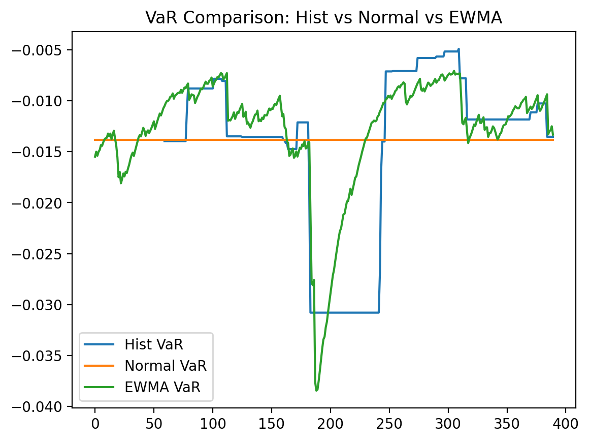
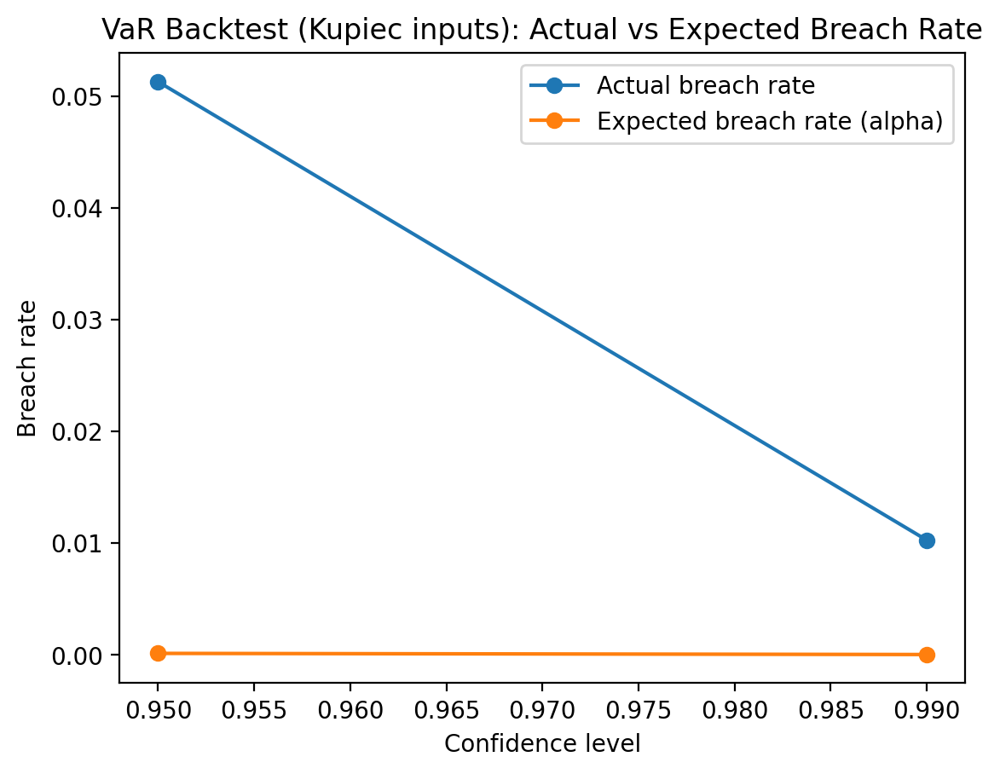
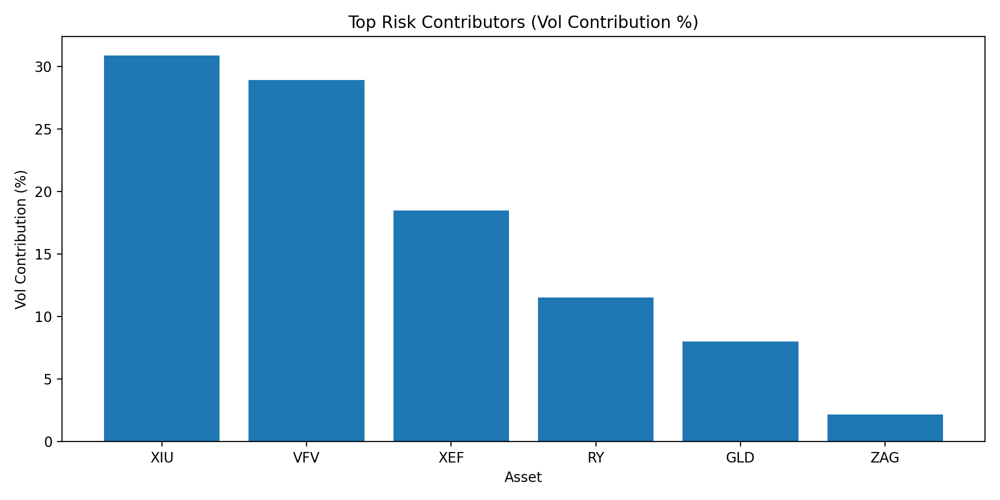

# Portfolio Risk War Room — Risk Report
This report is auto-generated from `outputs/tables` and `outputs/figures`.

## 1) Portfolio overview & performance snapshot

Key performance / risk metrics (from `data/risk_summary.csv`):

| asset | n_obs | ann_return | ann_vol | VaR_95_hist | CVaR_95_hist | max_drawdown |
| --- | --- | --- | --- | --- | --- | --- |
| XIU | 390 | 0.23844 | 0.131233 | -0.0127582 | -0.0196723 | -0.130071 |
| VFV | 390 | 0.157755 | 0.172943 | -0.0154669 | -0.0261015 | -0.193923 |
| XEF | 390 | 0.186001 | 0.143568 | -0.0119157 | -0.0209497 | -0.143264 |
| ZAG | 390 | 0.0140508 | 0.0516209 | -0.00507273 | -0.00728153 | -0.0428973 |
| GLD | 390 | 0.50014 | 0.219051 | -0.0183048 | -0.0306403 | -0.138677 |
| RY | 390 | 0.301641 | 0.167056 | -0.0152623 | -0.0240702 | -0.15357 |
| PORTFOLIO | 390 | 0.202049 | 0.0999083 | -0.00973764 | -0.014689 | -0.0956659 |

## 2) VaR model comparison (Hist vs Normal vs EWMA)

## 3) VaR backtest results

Backtest summary:

| method | confidence | alpha | N | VaR_threshold | breaches | breach_rate | kupiec_pvalue | christoffersen_pvalue | kupiec_pass_0.05 | christ_pass_0.05 |
| --- | --- | --- | --- | --- | --- | --- | --- | --- | --- | --- |
| hist | 0.99 | 0.01 | 390 | -0.0176636 | 4 | 0.0102564 | 0.959581 | 0.0257314 | True | False |
| hist | 0.95 | 0.05 | 390 | -0.00973764 | 20 | 0.0512821 | 0.907887 | 0.0148618 | True | False |

Kupiec test results:

| confidence | alpha | N | breaches | breach_rate | expected_breaches | kupiec_pvalue | pass_0.05 |
| --- | --- | --- | --- | --- | --- | --- | --- |
| 0.99 | 0.01 | 390 | 4 | 0.0102564 | 0.01 | 0.959581 | True |
| 0.95 | 0.05 | 390 | 20 | 0.0512821 | 0.05 | 0.907887 | True |

## 4) Historical stress scenarios

Historical scenario results:

| scenario_name | start_date | end_date | n_days_in_window | portfolio_return_over_window | max_drawdown_over_window | worst_day_in_window | worst_day_return | top_3_contributors_on_worst_day |
| --- | --- | --- | --- | --- | --- | --- | --- | --- |
| Worst 20D Window (in-sample) | 2025-03-12 | 2025-04-08 | 20 | -0.0607001 | -0.0864926 | 2025-04-04 | -0.0343536 | XIU:-1.10%, VFV:-1.00%, XEF:-0.84% |
| Worst 60D Window (in-sample) | 2025-01-14 | 2025-04-07 | 58 | -0.0434782 | -0.0882328 | 2025-04-04 | -0.0343536 | XIU:-1.10%, VFV:-1.00%, XEF:-0.84% |
| Worst Day Context (±10d) | 2025-03-25 | 2025-04-15 | 16 | -0.0329774 | -0.0864926 | 2025-04-04 | -0.0343536 | XIU:-1.10%, VFV:-1.00%, XEF:-0.84% |

## 5) Risk contribution (who drives portfolio risk?)

Risk contribution table:

| asset | weight | asset_vol_ann | portfolio_vol_ann | vol_contribution_pct |
| --- | --- | --- | --- | --- |
| XIU | 0.25 | 0.131233 | 0.0999083 | 30.8832 |
| VFV | 0.2 | 0.172943 | 0.0999083 | 28.9181 |
| XEF | 0.15 | 0.143568 | 0.0999083 | 18.496 |
| RY | 0.1 | 0.167056 | 0.0999083 | 11.5271 |
| GLD | 0.1 | 0.219051 | 0.0999083 | 8.00814 |
| ZAG | 0.2 | 0.0516209 | 0.0999083 | 2.16746 |

